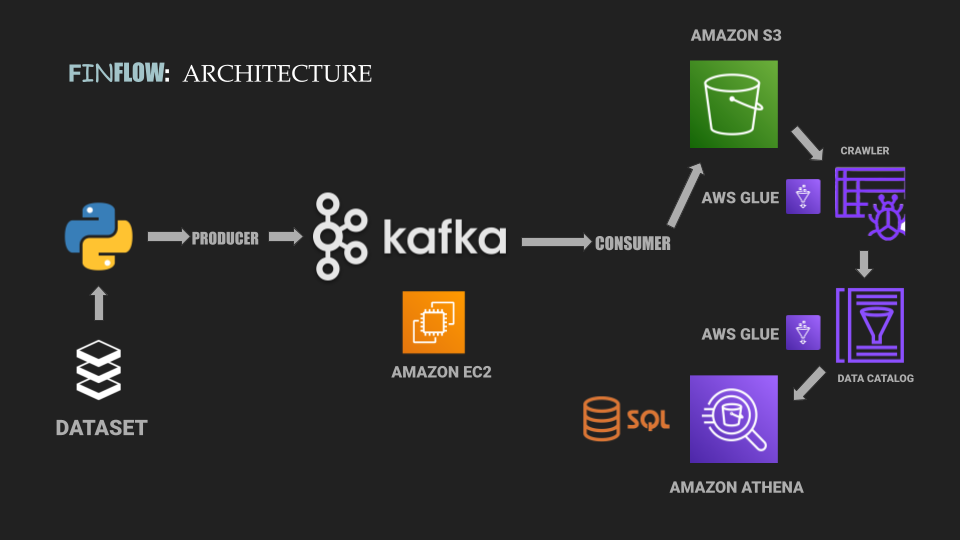

# Finflow: Real-Time Financial Stock Data Processing with Kafka and AWS


## Problem

In the rapidly evolving financial markets, real-time data is essential for making informed investment decisions. However, handling large-scale streaming data, processing it efficiently, and storing it in a structured format for analysis is challenging. Traditional data pipelines struggle to manage both the high volume and velocity of stock market data. Finflow aims to address these challenges by offering a real-time stock data pipeline, utilizing Kafka and AWS services for seamless, scalable data processing.

## Solution

**Finflow** is a real-time data streaming pipeline designed to fetch, process, and store stock market data. It leverages **Kafka** for high-throughput messaging and integrates with AWS services like **S3**, **Glue**, and **Athena** for processing, storing, and querying data. This allows financial analysts to receive live stock data and query it efficiently in a structured format.

Key features of Finflow include:
- Real-time data streaming with **Kafka**.
- On-demand querying with **Amazon Athena**.
- Scalable data storage in **AWS S3**.
- Data cataloging and ETL automation using **AWS Glue**.

## Architecture

Finflow follows a modular architecture that ensures flexibility, scalability, and high performance. The core components include:

1. **Producer**: A Kafka producer fetches stock market data, processes it, and sends it to Kafka topics for real-time streaming.
2. **Consumer**: A Kafka consumer retrieves the stock market data and sends it to AWS services.
3. **AWS S3**: Data is stored in an S3 bucket.
4. **AWS Glue**: Glue is used to crawl the S3 bucket and create a data catalog.
5. **Amazon Athena**: Athena is used to query the processed data in real-time.




## Techniques

### Kafka Producer

The Kafka producer is responsible for sending stock data from a dataset to a Kafka topic. The data is sent in batches, and optimizations like message batching, compression, and asynchronous sending are implemented to enhance throughput.

```python
producer = KafkaProducer(
    bootstrap_servers=[':9092'], 
    value_serializer=lambda x: dumps(x).encode('utf-8')
)

while True:
    dict_stock = df.sample(1).to_dict(orient="records")[0]
    producer.send('demo_test', value=dict_stock)
    sleep(1)
```

### Kafka Consumer

The Kafka consumer retrieves messages from the Kafka topic and processes them by writing each message to a JSON file in an AWS S3 bucket.

```python
consumer = KafkaConsumer(
    'demo_test',
    bootstrap_servers=[':9092'], 
    value_deserializer=lambda x: loads(x.decode('utf-8'))
)

for count, i in enumerate(consumer):
    with s3.open(f"s3://finflow/stock_market_{count}.json", 'w') as file:
        json.dump(i.value, file)
```

### AWS Integration

- **S3**: Used to store processed data.
- **Glue**: A Glue crawler automatically catalogs the data in S3, making it available for querying.
- **Athena**: Enables real-time querying of the data for financial analysis.

**KAFKA Architecture**


## Installation

1. Install the required libraries:
   ```bash
   pip install kafka-python pandas s3fs
   ```

2. Set up Kafka by configuring the producer and consumer in your environment.

3. Ensure you have access to an AWS account and configure your AWS credentials to connect to S3, Glue, and Athena.

## Usage

1. **Producer**: Run the producer script to continuously send stock data to the Kafka topic.
   ```bash
   python producer.py
   ```

2. **Consumer**: Run the consumer script to consume messages from Kafka and store them in S3.
   ```bash
   python consumer.py
   ```

3. Use **AWS Glue** to catalog the data stored in S3, and **Athena** to query the data for analysis.

## Optimizations

- **Batching**: The producer batches messages for better throughput.
- **Compression**: Messages are compressed using `gzip` to save network bandwidth.
- **Asynchronous Sending**: Sending messages asynchronously improves performance without blocking.

## Future Enhancements

- Implementing additional data preprocessing steps in real-time.
- Extending the pipeline to support more financial data sources.
- Integration with more analytical tools for advanced financial modeling.

## Conclusion

Finflow enables real-time financial data streaming and processing, helping analysts stay ahead in the fast-moving financial markets. By integrating Kafka with AWS services, the pipeline is both scalable and efficient, providing a solid foundation for advanced financial analysis.


---
